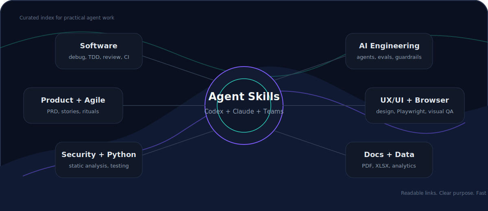

<p align="center">
  
</p>

<h1 align="center">AI Agent Skills Catalog</h1>

<p align="center">
  A curated hub of the most useful skills for Codex, Claude, and AI agents working across software engineering, product, UX/UI, architecture, and AI engineering.
</p>

<p align="center">
  <a href="SKILLS.md"></a>
  <a href="SKILLS.md"></a>
  <a href="CURATION.md"></a>
  <a href="https://github.com/MaiconKevyn/ai-agent-skills-catalog"></a>
</p>

## Why This Exists

Skills have become an operational layer for AI agents. They package workflows, tools, decision rules, and quality standards that an agent can reuse instead of rediscovering the same process on every task.

The problem is fragmentation. Useful skills are spread across official repositories, community indexes, specialist collections, and platform-specific docs. This repository is a practical index for answering four questions quickly:

- which skill should be used for a real task;
- where the public source link is;
- what problem the skill solves;
- which collections are worth tracking.

## Start Here

| File | Purpose |
|---|---|
| [SKILLS.md](SKILLS.md) | Main catalog with 108 skills and collections organized by category. |
| [CURATION.md](CURATION.md) | Criteria for accepting, rejecting, and reviewing skills. |

## Catalog Map

| Area | Use it for |
|---|---|
| Software Engineering | Refactoring, debugging, TDD, review, GitHub, and CI. |
| Python | Typing, tests, notebooks, static analysis, and packaged projects. |
| UX/UI | Design systems, shadcn/ui, Figma, frontend work, and visual review. |
| Product | PRDs, user stories, acceptance criteria, discovery, and roadmaps. |
| Agile and Scrum Master | Facilitation, sprint work, refinement, retrospectives, and meetings. |
| Clean Architecture | SOLID, APIs, entrypoints, spec compliance, and technical handoffs. |
| AI Architecture | MCP, LLM APIs, skill authoring, and agentic project structure. |
| AI Engineering | Evals, guardrails, observability, MLOps, and agent verification. |
| Security | Threat modeling, Semgrep, supply chain, review, and static analysis. |
| Browser and E2E | Playwright, screenshots, and browser-based end-to-end testing. |
| Documents and Office | PDF, DOCX, XLSX, PPTX, Notion, and document coauthoring. |
| Data and Analytics | CSV, dashboards, instrumentation, experiments, and metrics. |

## Reference Repositories

High-signal ecosystem references, checked on 2026-05-22.

| Repository | Signal | Why follow it |
|---|---:|---|
| [obra/superpowers](https://github.com/obra/superpowers) | 201k+ stars | Mature workflows for planning, testing, reviewing, and finishing agentic development tasks. |
| [anthropics/skills](https://github.com/anthropics/skills) | 138k+ stars | Official skills repository for Claude. |
| [shadcn-ui/ui](https://github.com/shadcn-ui/ui) | 114k+ stars | Strong reference for components, design systems, and code distribution. |
| [vercel-labs/agent-skills](https://github.com/vercel-labs/agent-skills) | 26k+ stars | Vercel's official collection for agents and modern web apps. |
| [VoltAgent/awesome-agent-skills](https://github.com/VoltAgent/awesome-agent-skills) | 22k+ stars | Broad directory of skills compatible with Claude Code, Codex, Gemini CLI, and Cursor. |
| [openai/skills](https://github.com/openai/skills) | 19k+ stars | Official skills catalog for Codex. |
| [trailofbits/skills](https://github.com/trailofbits/skills) | 5k+ stars | Technical skills for security, audits, and advanced review workflows. |

## Quick Paths

| If you want to... | Open |
|---|---|
| Publish code with an agent | [SKILLS.md](SKILLS.md) |
| Improve Python quality | [SKILLS.md](SKILLS.md) |
| Build stronger interfaces | [SKILLS.md](SKILLS.md) |
| Write PRDs or user stories | [SKILLS.md](SKILLS.md) |
| Run team rituals and alignment | [SKILLS.md](SKILLS.md) |
| Review architecture | [SKILLS.md](SKILLS.md) |
| Design agents and MCP tools | [SKILLS.md](SKILLS.md) |
| Evaluate AI systems | [SKILLS.md](SKILLS.md) |
| Check technical risk | [SKILLS.md](SKILLS.md) |
| Validate a web app in the browser | [SKILLS.md](SKILLS.md) |

## Editorial Standard

Each entry must be short, verifiable, and useful in real project work. The catalog avoids dead links, vague descriptions, and generic lists without context. The rule is simple: if a skill does not help an agent or a person execute a recurring task better, it does not belong in the main catalog.

See the full criteria in [CURATION.md](CURATION.md).

## How To Contribute

1. Open [SKILLS.md](SKILLS.md) and find the right category.
2. Add an entry with a name, public link, and objective description.
3. Confirm the link is public and the skill has enough documentation to review.
4. Keep the description to one short sentence.

Format:

```markdown
| modern-python | https://github.com/trailofbits/skills/tree/main/plugins/modern-python | Skill for modern Python practices, typing, structure, and security. |
```

## Short Roadmap

- Add platform tags: Codex, Claude, Cursor, Gemini CLI, and MCP.
- Separate official, community, and specialist collections.
- Add automated checks for links, duplicates, and long descriptions.
- Add practical-utility ranking and usage-frequency signals.

## Next Phase

The next planned step is to turn this catalog into a more searchable hub with:

- deeper discovery of important Claude and Codex skills;
- category files under `categories/`;
- structured metadata in `data/skills.yml`;
- source tracking in `data/sources.yml`;
- validation scripts for links, duplicates, and consistency;
- a final README update, commit, and push.

